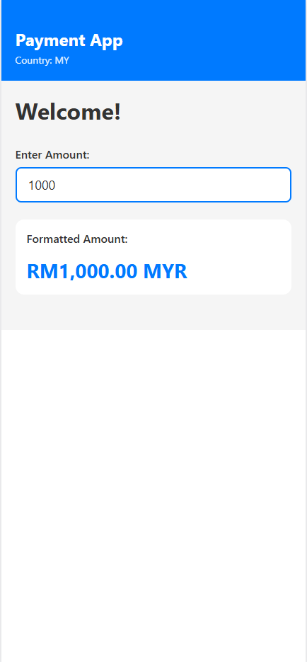
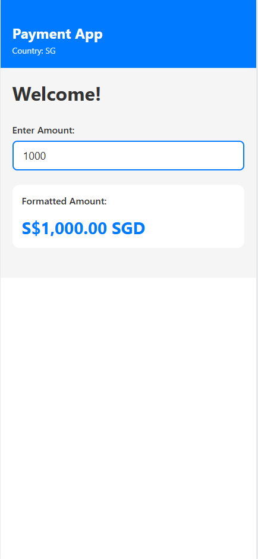
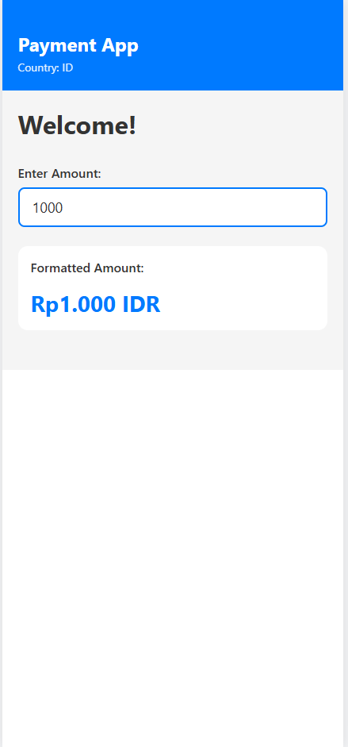

# Country-Specific Component Rendering POC

A proof-of-concept demonstrating how to build React Native components with country-specific configurations using component co-location pattern.

## What It Does

This project showcases a **component-specific configuration system** where each UI component can have different behaviors, styling, and formatting based on the selected country (Indonesia, Malaysia, Singapore).

## Screenshots

<table>
  <tr>
    <td align="center">
      <b>Malaysia (MY)</b><br/>
      
    </td>
    <td align="center">
      <b>Singapore (SG)</b><br/>
      
    </td>
    <td align="center">
      <b>Indonesia (ID)</b><br/>
      
    </td>
  </tr>
</table>

### Key Features

- 🌍 **Country-Specific Rendering**: Components automatically adapt to country context
- 💱 **Currency Formatting**: Different decimal places, symbols, and separators per country
  - **Indonesia (ID)**: `Rp1.000` (no decimals, dot separator)
  - **Malaysia (MY)**: `RM1,000.00` (2 decimals, comma separator)
  - **Singapore (SG)**: `S$1,000.00` (2 decimals, comma separator)
- 🎨 **Component Co-location**: Each component's config lives next to its implementation
- ⚙️ **Environment-based**: Country selection via environment variables
- 📦 **Monorepo Structure**: Nx workspace with shared component library

## How It Works

### Architecture

The project uses a **component co-location pattern** where each component has its own config folder with country-specific settings:

```
libs/mbb-ui-kit/
└── src/
    ├── components/
    │   └── CurrencyDisplay/
    │       ├── CurrencyDisplay.tsx       # Component implementation
    │       └── config/
    │           ├── index.ts              # Config interface & getter
    │           ├── id.ts                 # Indonesia config
    │           ├── my.ts                 # Malaysia config
    │           └── sg.ts                 # Singapore config
    └── context/
        └── CountryContext.tsx             # Global country state
```

### Component Configuration Pattern

1. **Define Config Interface** (`config/index.ts`):

```typescript
export interface CurrencyConfig {
  code: string;
  symbol: string;
  position: 'prefix' | 'suffix';
  decimals: number;
  locale: string;
  // ... other properties
}
```

2. **Create Country-Specific Configs** (`config/id.ts`, `my.ts`, `sg.ts`):

```typescript
export const idCurrencyConfig: CurrencyConfig = {
  code: 'IDR',
  symbol: 'Rp',
  decimals: 0,
  locale: 'id-ID',
  // ...
};
```

3. **Use in Component**:

```typescript
const { country } = useCountry();
const config = getCurrencyConfig(country);
// Component auto-adapts based on config
```

## Project Structure

```
mbb-poc/
├── apps/
│   └── mbb-country-render/          # React Native app
│       ├── src/
│       │   └── app/
│       │       ├── App.tsx          # Root with CountryProvider
│       │       └── TransferScreen.tsx  # Demo screen
│       ├── .env                      # Country configuration
│       └── vite.config.mts          # Web bundler config
│
├── libs/
│   └── mbb-ui-kit/                  # Shared component library
│       ├── src/
│       │   ├── components/
│       │   │   └── CurrencyDisplay/  # Example component
│       │   │       ├── CurrencyDisplay.tsx
│       │   │       └── config/       # Country configs
│       │   │           ├── index.ts
│       │   │           ├── id.ts
│       │   │           ├── my.ts
│       │   │           └── sg.ts
│       │   ├── context/
│       │   │   └── CountryContext.tsx  # Country state management
│       │   └── index.ts             # Library exports
│       └── package.json             # TurboModule config
│
├── package.json                     # Scripts for country-specific runs
└── README.md
```

## Run Tasks

### Run with Specific Country

```sh
npm run start:id    # Run with Indonesia
npm run start:my    # Run with Malaysia
npm run start:sg    # Run with Singapore
npm start           # Run with default from .env
```

### Development Server

```sh
npx nx serve mbb-country-render
```

The app will be available at http://localhost:4200/

### Production Build

```sh
npx nx build mbb-country-render
```

## Configuration

### Setting the Country

**Option 1: Environment Variable**

Edit `apps/mbb-country-render/.env`:

```
VITE_COUNTRY=ID
```

**Option 2: NPM Script**

Use predefined scripts:

```sh
npm run start:my   # Sets VITE_COUNTRY=MY
```

**Option 3: Manual**

```sh
SET VITE_COUNTRY=SG&& npx nx serve mbb-country-render
```

### Adding a New Country

1. **Add country code** to `CountryContext.tsx`:

```typescript
export type Country = 'ID' | 'MY' | 'SG' | 'TH'; // Add 'TH'
```

2. **Create config file** for each component:

```
libs/mbb-ui-kit/src/components/CurrencyDisplay/config/th.ts
```

3. **Export in config index**:

```typescript
import { thCurrencyConfig } from './th';

const currencyConfigs: Record<CountryCode, CurrencyConfig> = {
  // ... existing
  TH: thCurrencyConfig,
};
```

4. **Add npm script** in `package.json`:

```json
"start:th": "SET VITE_COUNTRY=TH&& nx serve mbb-country-render"
```

## Adding New Components

To add a new component with country-specific configuration:

1. **Create component folder structure**:

```
libs/mbb-ui-kit/src/components/YourComponent/
├── YourComponent.tsx
└── config/
    ├── index.ts    # Interface & getter
    ├── id.ts       # Indonesia config
    ├── my.ts       # Malaysia config
    └── sg.ts       # Singapore config
```

2. **Define config interface** (`config/index.ts`):

```typescript
export interface YourComponentConfig {
  // Define properties
}

export const getYourComponentConfig = (country: CountryCode) => {
  return configs[country];
};
```

3. **Create country configs** (`id.ts`, `my.ts`, `sg.ts`)

4. **Export from library** (`libs/mbb-ui-kit/src/index.ts`):

```typescript
export { YourComponent } from './components/YourComponent/YourComponent';
export { getYourComponentConfig } from './components/YourComponent/config';
```

5. **Use in app**:

```typescript
import { useCountry, YourComponent, getYourComponentConfig } from '@mbb-poc/mbb-ui-kit';

const { country } = useCountry();
const config = getYourComponentConfig(country);
```

## Technical Implementation

### Country State Management

Uses React Context API for global country state:

```typescript
// Wrap app with provider
<CountryProvider initialCountry="ID">
  <YourApp />
</CountryProvider>;

// Access in any component
const { country, setCountry } = useCountry();
```

### Environment Variable Flow

1. `.env` file or npm script sets `VITE_COUNTRY`
2. Vite exposes it as `import.meta.env.VITE_COUNTRY`
3. `App.tsx` reads it and passes to `CountryProvider`
4. All components access via `useCountry()` hook

### React Native Web Support

- Uses Vite for web bundling
- `react-native-web` aliases for cross-platform components
- Mobile-responsive viewport (430px container)

## Key Benefits

✅ **Scalable**: Easy to add new countries or components  
✅ **Type-Safe**: Full TypeScript support  
✅ **Maintainable**: Configs live with components  
✅ **No Prop Drilling**: Context-based state management  
✅ **Zero Config for Consumers**: Components auto-adapt
